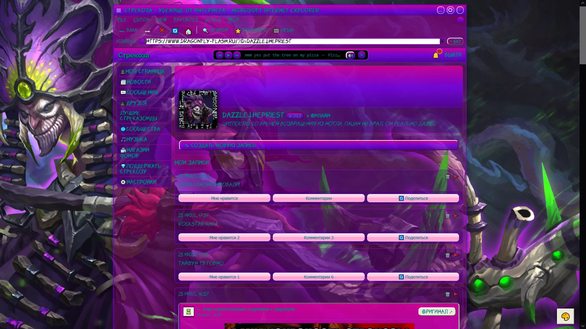

# Sparx

**Sparx - настройщик своей колхозной темы для «Стрекоза»**

Это кастомный userscpript, который позволяет настроить стрекозу по своему вкусу.
Он позволяет:
- Установить собственный фон;
- Изменить цвета;
- Настроить прозрачность (Привет, Frutiger Aero);
- Выбрать шрифт и цвет текста, а подключить собственный шрифт по ссылке;
- Сделать углы интерфейса менее острыми).

## Скриншот

## Установка

1. Установите Tampermonkey или Violentmonkey.
   В Chrome или Edge откройте управление расширением Tampermonkey или Violentmonkey и включите Allow User Scripts / Разрешить пользовательские скрипты.
   Если переключатель отсутствует, откройте chrome://extensions или edge://extensions и включите Режим разработчика.
3. Нажмите ссылку ниже и подтвердите установку скрипта.

[Установить Sparx](https://raw.githubusercontent.com/DazzleTheShadowPriest/Sparx/refs/heads/main/Sparx-v1.3.user.js)

4. Перезапустите сайт при нажатии Ctrl + F5.

5. P.s Не обращайте внимание на название файла пж, я блин дебил и неправильно назвал его. Он обновляется, просто... пожалуйста, не обращайте внимание на имя.
